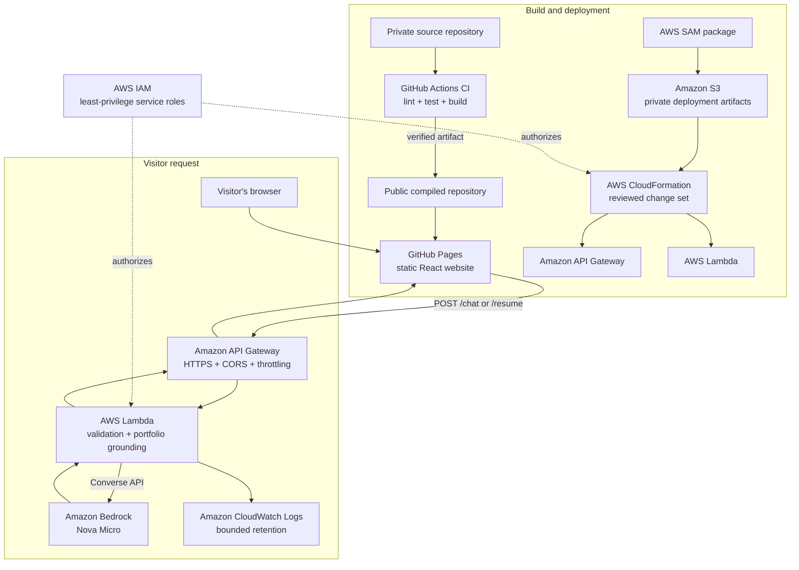

# Mussab ElDash — Portfolio

[View the live portfolio](https://mussabeldash.github.io/Portfolio/)

This public repository contains only the generated static files used by GitHub Pages. The application source, cloud infrastructure, tests, and operational documentation are maintained in a private source repository.

## What is published here

- Compiled HTML, CSS, and JavaScript
- Public images and downloadable résumé documents
- GitHub Pages configuration marker
- This redacted deployment README

## How GitHub Pages and AWS work together

The frontend remains a static React application on GitHub Pages. Only chatbot questions and résumé-tailoring requests cross into AWS; the browser never receives AWS credentials or permission to invoke a model directly.

| Service | How it is used |
| --- | --- |
| GitHub Actions | Verifies the private source with linting, tests, and a production build, then publishes only the compiled artifact |
| GitHub Pages | Serves the public static website and downloadable résumé files |
| Amazon API Gateway | Exposes the two HTTPS routes, applies restrictive CORS, and limits request rate and burst size |
| AWS Lambda | Validates requests, bounds conversation context, adds curated portfolio facts and response rules, and invokes the model |
| Amazon Bedrock | Uses Nova Micro to generate portfolio answers and tailored résumé drafts from the grounded prompt |
| Amazon CloudWatch Logs | Retains bounded backend diagnostic logs without storing a server-side chat history |
| Amazon S3 | Privately stores packaged Lambda deployment artifacts; it does not host the website |
| AWS CloudFormation and AWS SAM | Define, package, review, and deploy API and Lambda infrastructure through approval-gated change sets |
| AWS IAM | Gives CloudFormation and Lambda separate least-privilege service roles; no role credentials are included in browser code |

No cloud credentials, private keys, role policies, account identifiers, resource names, API addresses, or internal deployment instructions are stored in this repository.

## Generated repository

Files in this repository are published automatically by a CI/CD pipeline after the private source project passes linting, tests, and its production build. Pull requests run verification without publishing; approved changes to the private main branch release the verified compiled artifact here. Manual edits may be replaced by the next deployment.
