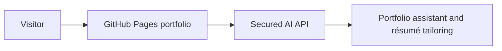

# Mussab ElDash — Portfolio

[View the live portfolio](https://mussabeldash.github.io/Portfolio/)

This public repository contains only the generated static files used by GitHub Pages. The application source, cloud infrastructure, tests, and operational documentation are maintained in a private source repository.

## What is published here

- Compiled HTML, CSS, and JavaScript
- Public images and downloadable résumé documents
- GitHub Pages configuration marker
- This redacted deployment README

The website is static except for AI requests, which are handled by a separately secured server-side service. No cloud credentials, private keys, IAM permissions, account identifiers, or internal deployment instructions are stored in this repository.

## Generated repository

Files in this repository are published automatically after the private source project passes its production build and tests. Manual edits may be replaced by the next deployment.
